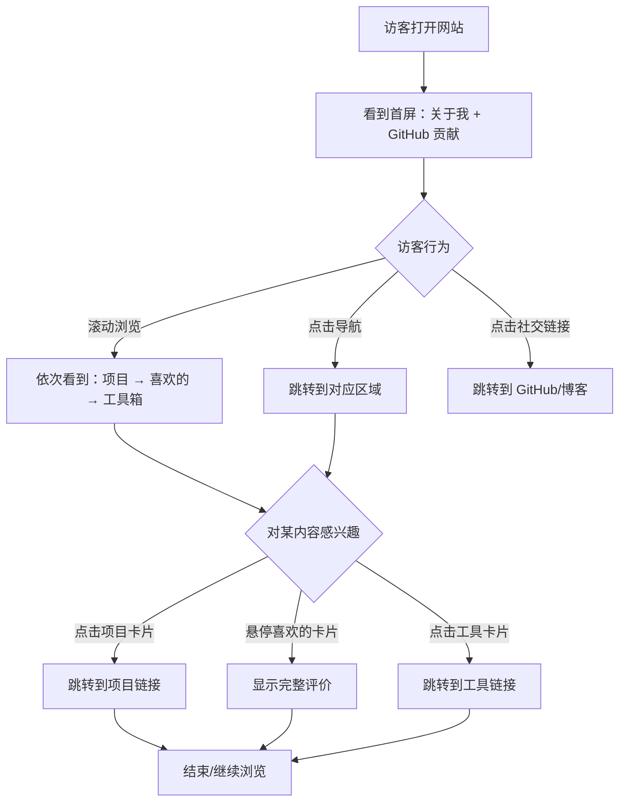

# 产品需求文档：个人主页 - V1.0

## 1. 综述 (Overview)

### 1.1 项目背景与核心问题

**背景：**
用户希望拥有一个属于自己的个人主页网站，用于展示自我、记录兴趣爱好、汇总常用工具。

**核心需求：**
- 一个让自己看着舒服、可以反复打开回味的个人空间
- 让陌生人访问时觉得"这个网站好看"、"这人挺有趣"
- 不希望被熟人发现（不会主动宣传）

**目标受众：**
- 第一受众：站长自己（看得舒服、方便使用）
- 第二受众：陌生访客（了解站长、产生兴趣）

**技术选型：**
| 项目 | 选择 |
|------|------|
| 框架 | Astro |
| 样式 | Tailwind CSS |
| 部署 | GitHub Pages |
| 域名 | xpfxzxc.github.io（暂定）|

**设计风格要求：**
- 简洁现代、色彩搭配好
- 不密密麻麻，内容易理解
- 可带点二次元氛围
- 桌面端优先，但需有移动端适配

### 1.2 核心业务流程 / 用户旅程地图

1. **阶段一：首次访问** — 访客打开网站，快速了解"这是谁"
2. **阶段二：深入浏览** — 访客对某个内容感兴趣，点击查看详情（项目、喜欢的东西）
3. **阶段三：工具使用** — 站长使用汇总区快速访问常用工具/网站

### 1.3 页面结构

**单页面 + 锚点导航**

页面布局（从上到下）：
1. 关于我 + GitHub 贡献（首屏）
2. 项目
3. 喜欢的东西（番剧/游戏/音乐）
4. 常用网站/工具
5. AI 工具

**导航栏项目：**
- 关于我
- 项目
- 喜欢的
- 工具箱

### 1.4 Mermaid 图

#### 1.4.1 用户操作流

### 1.5 非目标（明确不做的事）

- 不集成博客功能（已有独立博客）
- 第一版不做搜索功能
- 不做后台管理系统（内容直接写在代码里）

---

## 2. 用户故事详述 (User Stories)

### 阶段一：首次访问

---

#### **US-01: 作为访客，我希望看到站长的基本信息，以便于快速了解"这是谁"**

* **价值陈述 (Value Statement)**:
    * **作为** 访客
    * **我希望** 打开网站就能看到站长的基本信息
    * **以便于** 快速了解"这是谁"、对站长形成初步印象

* **业务规则与逻辑 (Business Logic)**:
    1. **前置条件**: 无
    2. **展示内容**:
        - 头像（先用占位图，后续可替换）
        - 网名：xpfxzxc
        - 一句话介绍：听障，无职，正在用 AI 探索可能性
        - 一句话信念（突出显示）：笨没关系，坚持就能进步；放弃了，就真的没机会了
        - 社交链接：
            - GitHub: https://github.com/xpfxzxc
            - 博客: https://github.com/xpfxzxc/xpfxzxc.github.io
    3. **UI 需求**:
        - 位于页面顶部/首屏，访客无需滚动即可看到
        - 布局简洁，不密密麻麻
        - 信念文字需突出显示（如引用样式、不同字体/颜色）
        - 社交链接可点击跳转（新标签页打开）

* **验收标准 (Acceptance Criteria)**:
    * **场景1: 正常访问**
        * **GIVEN** 访客打开网站首页
        * **WHEN** 页面加载完成
        * **THEN** 首屏显示头像、网名、一句话介绍、信念、社交链接
    * **场景2: 点击社交链接**
        * **GIVEN** 访客看到社交链接
        * **WHEN** 点击 GitHub 或博客链接
        * **THEN** 在新标签页打开对应链接

---

#### **US-02: 作为访客，我希望看到站长的 GitHub 贡献热力图，以便于了解站长的技术活跃度**

* **价值陈述 (Value Statement)**:
    * **作为** 访客
    * **我希望** 看到站长的 GitHub 贡献热力图
    * **以便于** 了解站长的技术活跃度和编码习惯

* **业务规则与逻辑 (Business Logic)**:
    1. **前置条件**: 无
    2. **展示内容**:
        - GitHub 用户名：xpfxzxc
        - 贡献热力图（类似 GitHub 个人主页的绿色格子图）
    3. **UI 需求**:
        - 位置：在"关于我"下方或附近
        - 可使用第三方服务嵌入（如 GitHub Readme Stats、github-contributions-api 等）

* **验收标准 (Acceptance Criteria)**:
    * **场景1: 正常显示**
        * **GIVEN** 访客在首屏区域
        * **WHEN** 页面加载完成
        * **THEN** 显示 GitHub 贡献热力图
    * **场景2: 第三方服务不可用**
        * **GIVEN** 第三方服务暂时不可用
        * **WHEN** 热力图加载失败
        * **THEN** 显示占位提示或隐藏该区域（不影响其他内容）

---

### 阶段二：深入浏览

---

#### **US-03: 作为访客，我希望看到站长正在做的项目，以便于了解站长在做什么**

* **价值陈述 (Value Statement)**:
    * **作为** 访客
    * **我希望** 看到站长正在做的项目列表
    * **以便于** 了解站长在做什么、有什么能力

* **业务规则与逻辑 (Business Logic)**:
    1. **前置条件**: 无
    2. **展示内容（每个项目）**:
        - 封面图（先用占位图）
        - 项目名称
        - 简短描述
        - 状态标签：刚开始做 / 进行中 / 已完成
        - 链接（可选，点击跳转到项目地址）
    3. **当前项目数据**:
        | 名称 | 描述 | 状态 |
        |------|------|------|
        | 二维码重建器 | 从图片提取二维码信息，重建成自定义美化的二维码 | 刚开始做 |
    4. **UI 需求**:
        - 卡片式布局
        - 状态标签用不同颜色/样式区分
        - 支持以后添加更多项目

* **验收标准 (Acceptance Criteria)**:
    * **场景1: 正常显示项目列表**
        * **GIVEN** 访客滚动到项目区域
        * **WHEN** 区域进入视口
        * **THEN** 显示项目卡片列表，每个卡片包含封面图、名称、描述、状态标签
    * **场景2: 点击项目卡片**
        * **GIVEN** 项目有链接
        * **WHEN** 访客点击项目卡片
        * **THEN** 在新标签页打开项目链接
    * **场景3: 项目无链接**
        * **GIVEN** 项目暂无链接
        * **WHEN** 访客点击项目卡片
        * **THEN** 无跳转行为（或显示"敬请期待"提示）

---

#### **US-04: 作为访客，我希望看到站长喜欢的番剧/游戏/音乐，以便于了解站长的兴趣爱好**

* **价值陈述 (Value Statement)**:
    * **作为** 访客
    * **我希望** 看到站长喜欢的番剧、游戏、音乐
    * **以便于** 了解站长的兴趣爱好，找到共同话题

* **业务规则与逻辑 (Business Logic)**:
    1. **前置条件**: 无
    2. **展示内容（每个条目）**:
        - 封面图（先用占位图）
        - 名称
        - 简短评价
    3. **分类与数据**:

        **番剧：**
        | 名称 | 评价 |
        |------|------|
        | 勇者处刑 惩罚勇者9004队服刑记录 | 经费燃烧，制作精美，动作画面感强劲，女主很萌 |
        | 【我推的孩子】第三季 | 制作一季比一季精良了！黑化后拥有黑星眼的露比很帅气，但是我是帽党，她最后能赢吗？ |
        | 凡人修仙传 | 国产 3D 动画巅峰之作，有生之年系列，很有代入感。看韩跑跑装逼也好，吃瘪也好，都感到很爽 |

        **游戏：**
        | 名称 | 评价 |
        |------|------|
        | 绝区零 | 米家游戏的质量不用质疑，角色建模精良，美术风格独特，但剧情比较俗套 |
        | OSU! | 点圈圈的游戏，免费音乐播放器（bushi），美术艺术感强。社区长年活跃，不得不说人类进化太快 |
        | 雨中冒险2 | 魂系游戏，喜欢玩的人一玩就上头，玩到最后竟然发现自己是侵略者。就是难度把控不好，经常感到有点牢 |

        **音乐：**
        | 名称 | 评价 |
        |------|------|
        | 大切な場所 | 日语入坑歌，听了上百遍，很有怀念的感觉，有段旋律我很喜欢。虽说只坚持学习日语一年多，最终因为自己的听力不好而放弃了 |
        | ぼくのフレンド | 有点洗脑，听起来很有感觉，虽然听不懂，但看了歌词后还是感受到共鸣 |
        | Refrain | 纯音乐，很好听，很有节奏感，有时会跟着哼唱 |

    4. **UI 需求**:
        - 三个类别放在同一页，按类别分组展示
        - 卡片式布局
        - 评价文字过长时用省略号截断
        - 鼠标悬停/触摸时显示完整评价（Tooltip 或展开）
        - 支持以后添加更多条目

* **验收标准 (Acceptance Criteria)**:
    * **场景1: 正常显示**
        * **GIVEN** 访客滚动到"喜欢的"区域
        * **WHEN** 区域进入视口
        * **THEN** 按番剧、游戏、音乐三个类别分组显示卡片
    * **场景2: 评价文字过长**
        * **GIVEN** 某条目的评价文字超过显示区域
        * **WHEN** 页面渲染
        * **THEN** 评价文字截断并显示省略号
    * **场景3: 查看完整评价**
        * **GIVEN** 评价文字被截断
        * **WHEN** 鼠标悬停或触摸卡片
        * **THEN** 显示完整评价内容

---

### 阶段三：工具使用

---

#### **US-05: 作为站长，我希望有一个区域汇总常用网站和工具，以便于快速访问**

* **价值陈述 (Value Statement)**:
    * **作为** 站长（网站所有者）
    * **我希望** 有一个区域汇总我常用的网站和工具
    * **以便于** 快速访问，不用每次去找书签

* **业务规则与逻辑 (Business Logic)**:
    1. **前置条件**: 无
    2. **展示内容（每个条目）**:
        - 图标/Logo（先用占位图）
        - 名称
        - 链接（点击跳转）
    3. **分类与数据**:

        **常用网站：**
        - Bilibili
        - 知乎
        - GitHub
        - OiiOii.ai
        - Lovart
        - LiblibAI
        - X

        **常用工具：**
        - CMD
        - PowerShell
        - VS Code
        - Git
        - CC-Switch
        - v2RayN
        - Edge

    4. **UI 需求**:
        - 按类别分组展示
        - 点击后在新标签页打开链接
        - 紧凑布局，方便快速定位

* **验收标准 (Acceptance Criteria)**:
    * **场景1: 正常显示**
        * **GIVEN** 访客/站长滚动到工具箱区域
        * **WHEN** 区域进入视口
        * **THEN** 按"常用网站"和"常用工具"两个类别分组显示
    * **场景2: 点击工具**
        * **GIVEN** 站长看到某个工具
        * **WHEN** 点击该工具
        * **THEN** 在新标签页打开对应链接

---

#### **US-06: 作为站长，我希望有一个区域汇总 AI 工具并按类别分组，以便于快速找到并访问**

* **价值陈述 (Value Statement)**:
    * **作为** 站长（网站所有者）
    * **我希望** 有一个区域汇总我常用的 AI 工具，按类别分组
    * **以便于** 快速找到并访问对应的 AI 工具

* **业务规则与逻辑 (Business Logic)**:
    1. **前置条件**: 无
    2. **展示内容（每个条目）**:
        - 图标/Logo（先用占位图）
        - 名称
        - 链接（点击跳转）
    3. **分类与数据**:

        | 类别 | 工具 |
        |------|------|
        | 文本 | DeepSeek、Gemini、Qwen |
        | 代码 | Claude Code、Codex、Gemini、GLM、Minimax |
        | 图像 | Nano Banana Pro、Seedream 4.5 |
        | 视频 | Seedance 3.0 Fast |
        | 搜索 | MiroThinker、Kagi Search、Perplexity |
        | 播客 | ListenHub |
        | PPT | ListenHub |
        | 工作流 | ComfyUI |

    4. **UI 需求**:
        - 按类别分组展示（8 个类别）
        - 点击后在新标签页打开链接
        - 类别标题清晰可辨

* **验收标准 (Acceptance Criteria)**:
    * **场景1: 正常显示**
        * **GIVEN** 访客/站长滚动到 AI 工具区域
        * **WHEN** 区域进入视口
        * **THEN** 按 8 个类别分组显示 AI 工具
    * **场景2: 点击 AI 工具**
        * **GIVEN** 站长看到某个 AI 工具
        * **WHEN** 点击该工具
        * **THEN** 在新标签页打开对应链接

---

## 3. 附录

### 3.1 数据汇总

**关于我：**
| 字段 | 内容 |
|------|------|
| 网名 | xpfxzxc |
| 一句话介绍 | 听障，无职，正在用 AI 探索可能性 |
| 一句话信念 | 笨没关系，坚持就能进步；放弃了，就真的没机会了 |
| GitHub | https://github.com/xpfxzxc |
| 博客 | https://github.com/xpfxzxc/xpfxzxc.github.io |

### 3.2 待补充项

- [ ] 头像图片
- [ ] 项目封面图
- [ ] 番剧/游戏/音乐封面图
- [ ] 工具图标/Logo
- [ ] 各工具的具体链接地址

### 3.3 后续迭代方向（非本版本范围）

- 搜索功能（工具箱区域）
- 更多项目展示
- 更多喜欢的东西
- 深色/浅色主题切换
- 更丰富的动效
