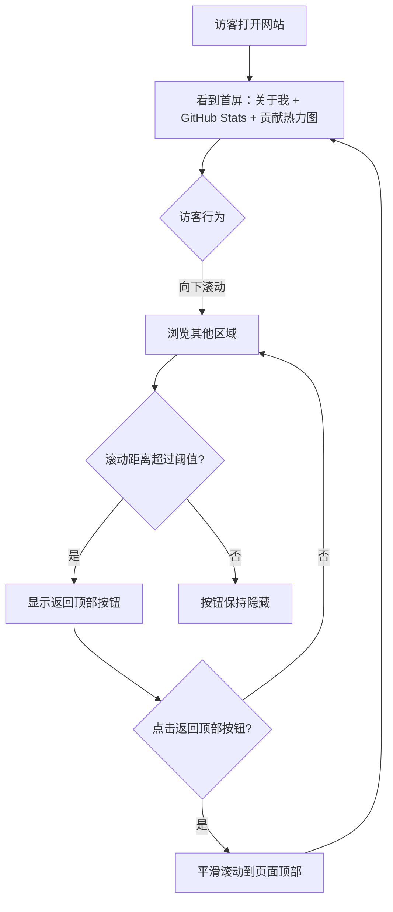
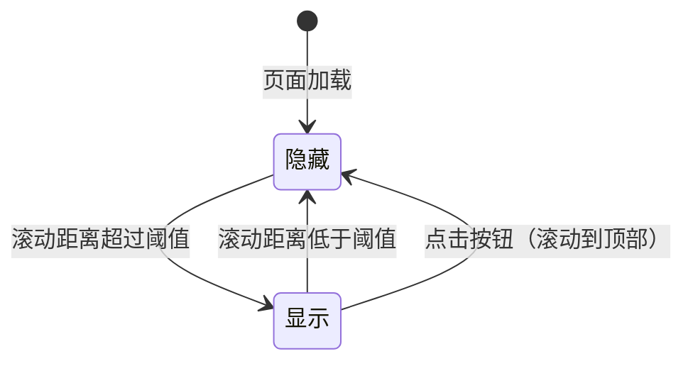

# 产品需求文档：个人主页增强功能 - V1.1

## 1. 综述 (Overview)

### 1.1 项目背景与核心问题

**背景：**
个人主页 V1.0 已上线，包含关于我、项目、喜欢的东西、工具箱等核心模块。在使用过程中，站长希望进一步增强页面的信息展示和用户体验。

**核心需求：**
1. 展示更丰富的 GitHub 数据统计，让访客更直观地了解站长的技术活跃度
2. 提供便捷的返回顶部功能，改善长页面的浏览体验

**目标受众：**
- 第一受众：站长自己（方便浏览、展示技术数据）
- 第二受众：陌生访客（了解站长技术活跃度）

### 1.2 核心业务流程 / 用户旅程地图

1. **阶段一：信息展示增强** — 在首屏展示 GitHub Stats 统计卡片
2. **阶段二：浏览体验优化** — 提供返回顶部的快捷方式

### 1.3 Mermaid 图

#### 1.3.1 用户操作流



#### 1.3.2 返回顶部按钮状态机



---

## 2. 用户故事详述 (User Stories)

### 阶段一：信息展示增强

---

#### **US-01: 作为访客，我希望看到站长的 GitHub 统计数据，以便于更全面地了解站长的技术活跃度**

* **价值陈述 (Value Statement)**:
    * **作为** 访客
    * **我希望** 看到站长的 GitHub 统计数据（如 Star 数、Commit 数、连续贡献天数等）
    * **以便于** 更全面地了解站长的技术活跃度和编码习惯

* **业务规则与逻辑 (Business Logic)**:
    1. **前置条件**: 无
    2. **展示内容**:
        - **Stats 卡片**：显示总 Star、Commit、PR、Issue 等统计数据
        - **Streak Stats 卡片**：显示连续贡献天数（当前连续、最长连续等）
    3. **数据来源**:
        - 使用 github-readme-stats 服务
        - GitHub 用户名：xpfxzxc
    4. **位置**:
        - 在现有 GitHub 贡献热力图的**上方**
    5. **UI 需求**:
        - 与网站整体风格协调
        - 卡片布局合理，不拥挤
    6. **异常处理**:
        - 若 github-readme-stats 服务不可用，显示占位提示或隐藏该区域（不影响其他内容）

* **验收标准 (Acceptance Criteria)**:
    * **场景1: 正常显示**
        * **GIVEN** 访客打开网站首页
        * **WHEN** 页面加载完成
        * **THEN** 在 GitHub 贡献热力图上方显示 Stats 卡片和 Streak Stats 卡片
    * **场景2: 第三方服务不可用**
        * **GIVEN** github-readme-stats 服务暂时不可用
        * **WHEN** 卡片加载失败
        * **THEN** 显示占位提示或隐藏该区域，不影响页面其他内容的正常显示

* **页面布局示意（位置关系）**:
    ```text
    ┌─────────────────────────────────────┐
    │           关于我区域                 │
    │   (头像、网名、介绍、信念、社交链接)   │
    ├─────────────────────────────────────┤
    │         GitHub Stats 卡片区域        │  ← 新增
    │   [ Stats 卡片 ]  [ Streak 卡片 ]    │
    ├─────────────────────────────────────┤
    │         GitHub 贡献热力图            │  ← 现有
    └─────────────────────────────────────┘
    ```

---

### 阶段二：浏览体验优化

---

#### **US-02: 作为访客/站长，我希望有一个返回顶部的快捷按钮，以便于快速回到页面顶部**

* **价值陈述 (Value Statement)**:
    * **作为** 访客或站长
    * **我希望** 在浏览长页面时有一个快捷按钮可以返回顶部
    * **以便于** 快速回到页面顶部，无需手动滚动

* **业务规则与逻辑 (Business Logic)**:
    1. **前置条件**: 无
    2. **按钮位置**:
        - 固定在视口右下角
    3. **显示逻辑**:
        - 页面加载时按钮隐藏
        - 当用户向下滚动超过一定距离后，按钮出现
        - 当用户滚动回顶部附近时，按钮隐藏
        - 具体阈值由 UI 设计决定
    4. **点击行为**:
        - 点击后平滑滚动到页面顶部
    5. **UI 需求**:
        - 与网站整体风格协调
        - 按钮不遮挡重要内容
        - 移动端同样适用

* **验收标准 (Acceptance Criteria)**:
    * **场景1: 页面初始状态**
        * **GIVEN** 访客刚打开网站
        * **WHEN** 页面加载完成，用户未滚动
        * **THEN** 返回顶部按钮不显示
    * **场景2: 滚动后显示按钮**
        * **GIVEN** 访客在页面上
        * **WHEN** 向下滚动超过一定距离
        * **THEN** 返回顶部按钮出现在视口右下角
    * **场景3: 点击返回顶部**
        * **GIVEN** 返回顶部按钮已显示
        * **WHEN** 访客点击该按钮
        * **THEN** 页面平滑滚动到顶部
    * **场景4: 滚动回顶部后隐藏**
        * **GIVEN** 返回顶部按钮已显示
        * **WHEN** 用户滚动回页面顶部附近
        * **THEN** 返回顶部按钮隐藏

* **页面布局示意（位置关系）**:
    ```text
    ┌─────────────────────────────────────┐
    │                                     │
    │           页面内容区域               │
    │                                     │
    │                                     │
    │                             ┌─────┐ │
    │                             │  ↑  │ │ ← 返回顶部按钮
    │                             └─────┘ │    (固定在视口右下角)
    └─────────────────────────────────────┘
    ```

---

## 3. 附录

### 3.1 技术参考

**github-readme-stats 服务：**
- Stats 卡片：`https://github-readme-stats.vercel.app/api?username=xpfxzxc`
- Streak Stats 卡片：`https://github-readme-streak-stats.herokuapp.com/?user=xpfxzxc`

### 3.2 与 V1.0 的关系

本文档为增量需求，基于 PRD-001（个人主页 V1.0）进行功能扩展，不修改原有功能。
