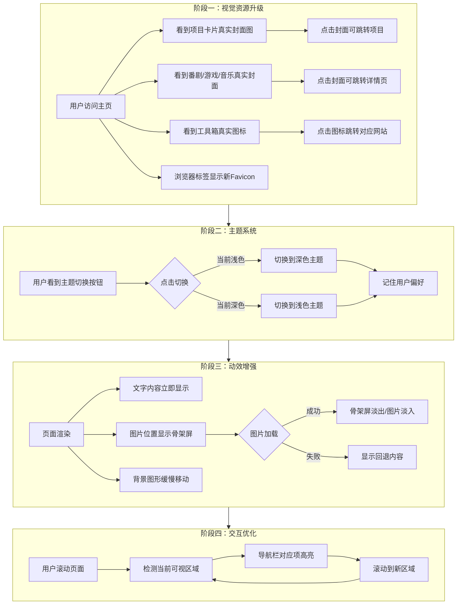
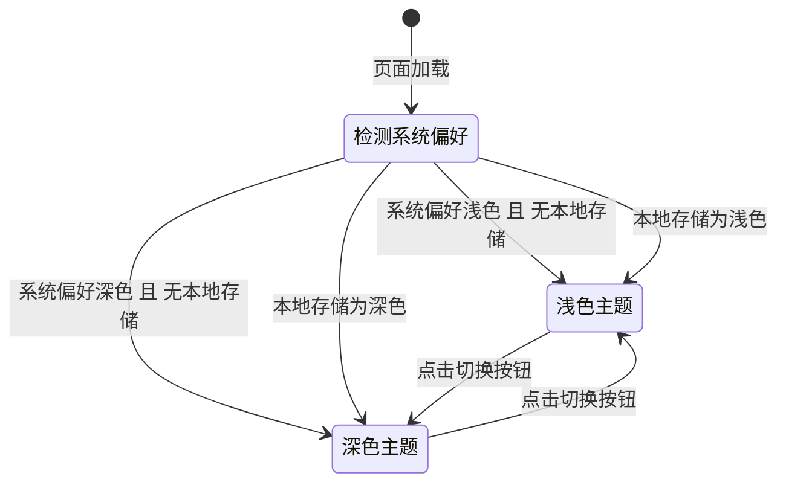

# 产品需求文档：个人主页美化升级 - V1.2

## 1. 综述 (Overview)

### 1.1 项目背景与核心问题

**背景：**
个人主页 V1.0 和 V1.1 已上线，包含关于我、项目、喜欢的东西、工具箱等核心模块，以及 GitHub Stats 和返回顶部功能。在使用过程中，站长希望进一步美化页面视觉效果，提升用户体验。

**核心需求：**
1. 将占位图片/图标替换为真实资源，增强视觉吸引力
2. 添加浅色/深色主题切换，适应不同使用场景
3. 添加动效增强，提升页面质感
4. 优化导航交互，改善浏览体验

**目标受众：**
- 第一受众：站长自己（个性化展示）
- 第二受众：陌生访客（获得更好的浏览体验）

### 1.2 核心业务流程 / 用户旅程地图

1. **阶段一：视觉资源升级** — 将项目封面、番剧/游戏/音乐封面、工具箱图标、Favicon 替换为真实资源
2. **阶段二：主题系统** — 添加浅色/深色主题切换功能
3. **阶段三：动效增强** — 添加背景图形移动特效和骨架屏加载效果
4. **阶段四：交互优化** — 导航栏随滚动动态显示激活状态

### 1.3 Mermaid 图

#### 1.3.1 用户操作流



#### 1.3.2 主题切换状态机



---

## 2. 用户故事详述 (User Stories)

### 阶段一：视觉资源升级

---

#### **US-01: 作为访客，我希望看到项目的真实封面图，以便于更直观地了解项目内容**

* **价值陈述 (Value Statement)**:
    * **作为** 访客
    * **我希望** 看到项目的真实封面图
    * **以便于** 更直观地了解项目内容

* **业务规则与逻辑 (Business Logic)**:
    1. **前置条件**: 无
    2. **操作流程 (Happy Path)**:
        - 访客打开网站，浏览到项目区域
        - 项目卡片显示真实封面图（16:9 比例）
        - 点击封面图跳转到项目链接（如有）
    3. **异常处理 (Error Handling)**:
        - 无封面图配置：显示渐变背景 + 占位图标
        - 外部图片加载失败：回退到渐变背景 + 占位图标
        - 无项目链接：封面图不可点击

* **验收标准 (Acceptance Criteria)**:
    * **场景1: 正常显示封面图**
        * **GIVEN** 项目已配置封面图
        * **WHEN** 访客浏览到项目区域
        * **THEN** 项目卡片显示真实封面图，比例为 16:9，不变形
    * **场景2: 点击封面图跳转**
        * **GIVEN** 项目已配置封面图和链接
        * **WHEN** 访客点击封面图
        * **THEN** 跳转到项目链接
    * **场景3: 无封面图**
        * **GIVEN** 项目未配置封面图
        * **WHEN** 访客浏览到项目区域
        * **THEN** 显示渐变背景 + 占位图标
    * **场景4: 图片加载失败**
        * **GIVEN** 项目配置的外部图片 URL 无法访问
        * **WHEN** 图片加载失败
        * **THEN** 回退显示渐变背景 + 占位图标

* **封面图来源**: 支持本地图片和外部 URL

---

#### **US-02: 作为访客，我希望看到番剧/游戏/音乐的真实封面图，以便于更直观地了解内容**

* **价值陈述 (Value Statement)**:
    * **作为** 访客
    * **我希望** 看到番剧/游戏/音乐的真实封面图
    * **以便于** 更直观地了解内容

* **业务规则与逻辑 (Business Logic)**:
    1. **前置条件**: 无
    2. **操作流程 (Happy Path)**:
        - 访客打开网站，浏览到喜欢的区域
        - 番剧/游戏/音乐卡片显示真实封面图（16:9 比例）
        - 点击卡片跳转到详情页（Bilibili、Steam、网易云等）
    3. **异常处理 (Error Handling)**:
        - 无封面图配置：显示渐变背景 + 分类图标
        - 外部图片加载失败：回退到渐变背景 + 分类图标
        - 无链接配置：卡片不可点击

* **验收标准 (Acceptance Criteria)**:
    * **场景1: 正常显示封面图**
        * **GIVEN** 番剧/游戏/音乐已配置封面图
        * **WHEN** 访客浏览到喜欢的区域
        * **THEN** 卡片显示真实封面图，比例为 16:9，不变形
    * **场景2: 点击卡片跳转**
        * **GIVEN** 卡片已配置封面图和链接
        * **WHEN** 访客点击卡片
        * **THEN** 跳转到对应详情页
    * **场景3: 无封面图**
        * **GIVEN** 卡片未配置封面图
        * **WHEN** 访客浏览到喜欢的区域
        * **THEN** 显示渐变背景 + 分类图标
    * **场景4: 图片加载失败**
        * **GIVEN** 卡片配置的外部图片 URL 无法访问
        * **WHEN** 图片加载失败
        * **THEN** 回退显示渐变背景 + 分类图标

* **封面图来源**: 支持本地图片和外部 URL

---

#### **US-03: 作为访客，我希望看到常用网站/工具/AI工具的真实图标，以便于快速识别**

* **价值陈述 (Value Statement)**:
    * **作为** 访客
    * **我希望** 看到常用网站/工具/AI工具的真实图标
    * **以便于** 快速识别

* **业务规则与逻辑 (Business Logic)**:
    1. **前置条件**: 无
    2. **操作流程 (Happy Path)**:
        - 访客打开网站，浏览到工具箱区域
        - 常用网站/工具显示真实图标（20x20px）
        - AI 工具显示真实图标（24x24px）
        - 点击图标跳转到对应网站
    3. **异常处理 (Error Handling)**:
        - 无图标配置：显示名称首字母
        - 图标加载失败：回退到名称首字母

* **验收标准 (Acceptance Criteria)**:
    * **场景1: 正常显示图标**
        * **GIVEN** 工具已配置图标
        * **WHEN** 访客浏览到工具箱区域
        * **THEN** 显示真实图标，尺寸正确，不变形
    * **场景2: 无图标**
        * **GIVEN** 工具未配置图标
        * **WHEN** 访客浏览到工具箱区域
        * **THEN** 显示名称首字母
    * **场景3: 图标加载失败**
        * **GIVEN** 工具配置的图标 URL 无法访问
        * **WHEN** 图标加载失败
        * **THEN** 回退显示名称首字母

* **图标来源**: 支持本地图片和外部 URL
* **图标尺寸**: 常用网站/工具 20x20px，AI 工具 24x24px

---

#### **US-04: 作为访客，我希望在浏览器标签页和设备主屏幕看到网站专属图标，以便于快速识别**

* **价值陈述 (Value Statement)**:
    * **作为** 访客
    * **我希望** 在浏览器标签页和设备主屏幕看到网站专属图标
    * **以便于** 快速识别

* **业务规则与逻辑 (Business Logic)**:
    1. **前置条件**: 用户提供现成的 Favicon 文件
    2. **操作流程 (Happy Path)**:
        - 访客打开网站，浏览器标签页显示新 Favicon
        - iOS 用户添加到主屏幕，显示 Apple Touch Icon
        - Android 用户添加到主屏幕，显示正确图标
    3. **支持格式**:
        - favicon.ico（传统浏览器）
        - favicon.svg（现代浏览器）
        - apple-touch-icon.png（180x180px，iOS 主屏幕）
        - favicon-32x32.png（标准尺寸）
        - favicon-16x16.png（小尺寸）
        - android-chrome-192x192.png（Android 主屏幕）
        - android-chrome-512x512.png（Android 启动画面）

* **验收标准 (Acceptance Criteria)**:
    * **场景1: 浏览器标签页**
        * **GIVEN** 访客打开网站
        * **WHEN** 页面加载完成
        * **THEN** 浏览器标签页显示新 Favicon
    * **场景2: iOS 主屏幕**
        * **GIVEN** iOS 用户将网站添加到主屏幕
        * **WHEN** 添加完成
        * **THEN** 主屏幕显示 Apple Touch Icon
    * **场景3: Android 主屏幕**
        * **GIVEN** Android 用户将网站添加到主屏幕
        * **WHEN** 添加完成
        * **THEN** 主屏幕显示正确图标
    * **场景4: 图标清晰度**
        * **GIVEN** 各尺寸图标已配置
        * **WHEN** 在不同设备/场景下显示
        * **THEN** 图标清晰不模糊

---

### 阶段二：主题系统

---

#### **US-05: 作为访客，我希望能切换浅色/深色主题，以便于在不同环境下舒适浏览**

* **价值陈述 (Value Statement)**:
    * **作为** 访客
    * **我希望** 能切换浅色/深色主题
    * **以便于** 在不同环境下舒适浏览

* **业务规则与逻辑 (Business Logic)**:
    1. **前置条件**: 无
    2. **操作流程 (Happy Path)**:
        - 访客打开网站，根据系统设置自动应用对应主题
        - 访客点击导航栏右侧的主题切换按钮
        - 页面平滑过渡到另一主题
        - 用户偏好被记住，下次访问保持
    3. **按钮位置**:
        - 桌面端：导航栏右侧，在菜单右侧
        - 移动端：导航栏右侧，在汉堡菜单左侧
    4. **按钮样式**:
        - 浅色主题时：显示月亮图标（点击切换到深色）
        - 深色主题时：显示太阳图标（点击切换到浅色）
    5. **默认主题**: 跟随系统设置
    6. **用户偏好**: 记住用户选择，下次访问保持
    7. **切换动画**: 平滑过渡
    8. **深色配色**: 由 UI/UX skill 设计

* **验收标准 (Acceptance Criteria)**:
    * **场景1: 首次访问跟随系统**
        * **GIVEN** 访客首次访问网站
        * **WHEN** 页面加载完成
        * **THEN** 主题跟随系统设置（浅色/深色）
    * **场景2: 点击切换主题**
        * **GIVEN** 当前为浅色主题
        * **WHEN** 访客点击主题切换按钮
        * **THEN** 页面平滑过渡到深色主题，按钮图标变为太阳
    * **场景3: 记住用户偏好**
        * **GIVEN** 访客手动切换到深色主题
        * **WHEN** 访客刷新页面或再次访问
        * **THEN** 页面保持深色主题
    * **场景4: 深色主题可读性**
        * **GIVEN** 当前为深色主题
        * **WHEN** 访客浏览页面
        * **THEN** 所有页面元素可读性良好

* **页面布局线框图 (ASCII Wireframe)**:
    ```text
    桌面端：
    ┌─────────────────────────────────────────────────────────────────┐
    │  导航栏 (固定顶部)                                                │
    ├─────────────────────────────────────────────────────────────────┤
    │                                                                 │
    │   Logo/站名      [关于我] [项目] [喜欢的] [工具箱]      [☀/🌙]   │
    │                  └──────── 导航菜单 ────────┘          ↑        │
    │                                                    主题切换     │
    │                                                                 │
    └─────────────────────────────────────────────────────────────────┘

    移动端：
    ┌─────────────────────────┐
    │  Logo/站名    [☀/🌙] [≡] │
    │               ↑      ↑   │
    │           主题切换  菜单  │
    └─────────────────────────┘
    ```

---

### 阶段三：动效增强

---

#### **US-06: 作为访客，我希望看到简单透明的背景动效，以增强页面视觉氛围**

* **价值陈述 (Value Statement)**:
    * **作为** 访客
    * **我希望** 看到简单透明的背景动效
    * **以便于** 增强页面视觉氛围

* **业务规则与逻辑 (Business Logic)**:
    1. **前置条件**: 无
    2. **操作流程 (Happy Path)**:
        - 访客打开网站
        - 背景有简单透明的图形移动特效
        - 特效不干扰内容阅读
    3. **设计要求**:
        - 简单、透明、不干扰内容阅读
        - 动画流畅，不影响页面性能
    4. **具体设计**: 由 UI/UX skill 设计（图形类型、数量、移动方式、透明度等）

* **验收标准 (Acceptance Criteria)**:
    * **场景1: 背景特效显示**
        * **GIVEN** 访客打开网站
        * **WHEN** 页面加载完成
        * **THEN** 背景有图形移动特效
    * **场景2: 不干扰内容**
        * **GIVEN** 背景特效正在运行
        * **WHEN** 访客阅读页面内容
        * **THEN** 特效简单透明，不干扰内容阅读
    * **场景3: 性能表现**
        * **GIVEN** 背景特效正在运行
        * **WHEN** 访客滚动或交互
        * **THEN** 动画流畅，页面性能不受明显影响

---

#### **US-07: 作为访客，我希望在图片加载时看到骨架屏占位，以获得更好的加载体验**

* **价值陈述 (Value Statement)**:
    * **作为** 访客
    * **我希望** 在图片加载时看到骨架屏占位
    * **以便于** 获得更好的加载体验

* **业务规则与逻辑 (Business Logic)**:
    1. **前置条件**: 无
    2. **操作流程 (Happy Path)**:
        - 访客打开网站，文字内容立即显示
        - 需要加载的图片位置显示骨架屏占位
        - 图片加载完成后骨架屏淡出，图片淡入
    3. **覆盖范围**: 仅针对可能需要较长加载时间的图片内容
        - 个人头像
        - GitHub Stats 卡片（github-readme-stats）
        - GitHub Streak Stats 卡片
        - GitHub 贡献图
        - 项目封面图
        - 番剧/游戏/音乐封面图
    4. **不使用骨架屏的内容**:
        - 所有文字内容（直接显示）
        - 页面布局结构
        - 导航栏、Footer 等静态区域
        - 工具箱小图标（尺寸小，无需骨架屏）
    5. **实现方式**: 局部骨架屏（inline skeleton），不使用全屏覆盖式骨架屏
    6. **样式设计**: 渐变动画效果，与实际图片尺寸一致

* **验收标准 (Acceptance Criteria)**:
    * **场景1: 文字内容立即显示**
        * **GIVEN** 访客打开网站
        * **WHEN** 页面开始渲染
        * **THEN** 所有文字内容立即显示，无需等待
    * **场景2: 图片位置显示骨架屏**
        * **GIVEN** 图片正在加载
        * **WHEN** 访客观察图片位置
        * **THEN** 显示与图片尺寸一致的骨架屏占位，带渐变动画
    * **场景3: 图片加载完成**
        * **GIVEN** 图片加载完成
        * **WHEN** 骨架屏消失
        * **THEN** 过渡自然流畅，图片淡入显示
    * **场景4: 图片加载失败**
        * **GIVEN** 图片加载失败
        * **WHEN** 骨架屏消失
        * **THEN** 显示对应的回退内容（占位图标或首字母）
    * **场景5: 页面可滚动**
        * **GIVEN** 页面正在加载图片
        * **WHEN** 访客滚动页面
        * **THEN** 页面正常滚动，骨架屏不会固定遮挡内容

---

### 阶段四：交互优化

---

#### **US-08: 作为访客，我希望导航栏能显示当前所在区域，以便于了解浏览位置**

* **价值陈述 (Value Statement)**:
    * **作为** 访客
    * **我希望** 导航栏能显示当前所在区域
    * **以便于** 了解浏览位置

* **业务规则与逻辑 (Business Logic)**:
    1. **前置条件**: 无
    2. **操作流程 (Happy Path)**:
        - 访客滚动页面
        - 当某区域顶部进入视口一定距离后，对应导航项高亮
        - 点击导航项，平滑滚动到对应区域，导航项立即激活
    3. **激活判定**: 区域顶部进入视口一定距离后激活对应导航项
    4. **点击行为**: 平滑滚动到对应区域，并激活该导航项
    5. **样式设计**: 由 UI/UX skill 设计

* **验收标准 (Acceptance Criteria)**:
    * **场景1: 滚动激活**
        * **GIVEN** 访客在页面上
        * **WHEN** 滚动到某区域
        * **THEN** 导航栏对应项自动高亮
    * **场景2: 动态变化**
        * **GIVEN** 导航栏某项已高亮
        * **WHEN** 访客滚动到另一区域
        * **THEN** 高亮状态随滚动位置动态变化
    * **场景3: 点击导航**
        * **GIVEN** 访客在页面上
        * **WHEN** 点击导航项
        * **THEN** 平滑滚动到对应区域，导航项立即激活
    * **场景4: 样式清晰**
        * **GIVEN** 导航项处于激活状态
        * **WHEN** 访客观察导航栏
        * **THEN** 激活状态样式清晰可辨

---

## 3. 附录

### 3.1 与前版本的关系

本文档为增量需求，基于 PRD-001（个人主页 V1.0）和 PRD-002（个人主页增强功能 V1.1）进行功能扩展，不修改原有功能。

### 3.2 设计说明

以下内容由 UI/UX skill 负责设计：
- US-05：深色主题配色方案
- US-06：背景图形移动特效（图形类型、数量、移动方式、透明度等）
- US-07：骨架屏样式
- US-08：导航栏激活状态样式
